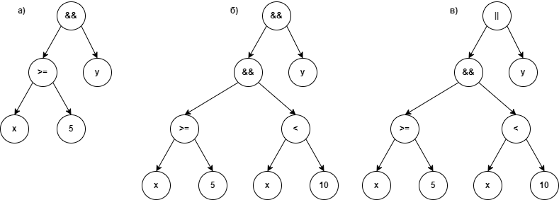

# Большое домашнее задание 1 (версия 2)
# In-memory Database

## Описание

База данных (файл ```database.h```) состоит из нескольких именованных таблиц. 
Каждая таблица (файл ```table.h```) состоит из списка описателей столбцов (структура ```Column``` в файле ```column.h```),
который задается при создании новой таблицы.
Данные хранятся в виде непрерывной неструктурированной области памяти (```uint8_t *storage```).
Адреса строк таблицы вычисляются как

```C++
uint8_t *row_ptr = storage + row_index * row_size;
```

Параметр ```row_size``` вычисляется при создании таблицы на основе данных из списка описателей столбцов.
Каждый столбец имеет тип и соответствующий размер (int32 - 4 байта, bool - 1 байт, длина строкового и 
байтового типов задается явно в описателе столбца). ```row_size``` является суммой размеров всех столбцов.
Описатель столбца (структура ```Column```) помимо прочего содержит поле ```offset```, которое содержит
смещение столбца от начала строки. ```offset``` для каждого столбца вычисляется при создании таблицы 
вместе с вычислением ```row_size``` (как сумма размеров предыдущих столбцов). 
Тогда адреса полей в строке таблицы вычисляются как

```C++
uint8_t *value_ptr = row_ptr + column_offset;
```

Для чтения/записи значений из таблицы выполняется преобразование этого указателя в соответствующий тип.

Память для данных выделяется с запасом, для ускорения операций добавления новых строк. Стратегия выделения 
памяти похожа на ту, которая используется в ```std::vector``` - при исчерпании места под данные текущая 
емкость удваивается, создается новая область памяти удвоенного размера и данные копируются туда.

Интерфейс базы данных, в целом, аналогичен примеру из задания:

```C++
#include <memdb.h>
memdb::Database db;
db.load_from_file(std::ifstream("db.bin", ios::bin));
auto rs = db.execute(query);
if (rs.is_ok()) {
    for (auto &row : rs) {
        int i = row.get<int>("column1");
        std::string s = row.get<std::string>("column2");
        do_something(i, s);
    }
} else {
    std::cerr << "Error: " << result.get_error() << "\n";
}
db.save_to_file(std::ofstream("db.bin", ios::bin));
```

Для разбора запроса выборки данных пришлось реализовать более сложный анализатор, чем для других запросов, для разбора части `condition` 
этого запроса. Реализованный анализатор сначала строит абстрактное синтаксическое дерево (abstract syntax tree, AST) для `condition`. 
Примеры AST показаны на Рисунке. В листьях такого дерева находятся литералы и "переменные" - названия столбцов, а во внутренних узлах - 
операции. Двуместные операции имеют двух потомков, одноместные - одного. Потомки внутреннего узла являются операндами его операции и 
могут указывать как на листья, так и на другие внутренние узлы.



На рисунке а) показано условие `x >= 5 && y`, на рисунке б) показано условие `x >= 5 && x < 10 && y`, а на рисунке в) - `x >= 5 && x < 10 || y`. 

Чем выше приоритет операции (естественный или за счет скобок), тем ниже узел в дереве, а в корне находится узел с самым низким приоритетом операции, 
которая выполняется в последнюю очередь. Логические операции в C++ имеют самый низкий приоритет, затем идут операции сравнения, и потом арифметические. 
Из логических операций "ИЛИ" имеет самый низкий приоритет, а "И" - самый высокий.

После построения дерево оно, по-возможности, упрощается (чтобы рекурсивно убрать внутренние узлы, потомками которых являются только листья, 
например, выражения вида "1 + 2", т.е. те, которые можно предварительно вычислить). Потом составляется таблица символов (Symbol Table), в которую 
записываются найденные в дереве символы (имена столбцов) вместе с указателями на листья, в которых они были найдены. Выборка из таблицы БД происходит 
следующим образом:

 - для каждой строки из таблицы БД извлекаются значения тех столбцов, которые присутствуют в таблице символов, и подставляются во все связанные с ними 
 узлы-листья AST;
 - вычисляется логический результат выражения, записанного в AST;
 - если результат true, то строка из таблицы БД записывается в выборку.

Для ускорения выборки используются ordered-индексы, которые представляет собой массив индексов строк, упорядоченный по значениям заданного столбца. 
Имея упорядоченный массив, мы можем выполнять быстрый бинарный поиск по столбцу, что позволяет быстро найти кандитатов на выборку. Например, у нас 
есть условие `x >= 5 && x < 10 && y`. Без использования индекса придется проверить каждую строку таблицы на соответствие заданному условию. 
При использовании индекса с помощью бинарного поиска находится нижняя и верхняя граница диапазона выборки, что может значительно 
сократить количество проверяемых строк таблицы. Чем уже полученный диапазон, тем быстрее будет проходить выборка. Если же диапазон выборки 
получается слишком широким (вплоть до того, что в него входят все строки таблицы), то в этом случае выборка может работать медленнее, 
чем без использования индексов, из-за дополнительных накладных расходов. Если имеется несколько индексов по разным колонкам, то используется 
только один, тот, который дает более узкий диапазон.

Для того, чтобы индексы могли быть задействованы, условие должно быть задано только с использованием логического "И". Это значит, что должны 
выполниться все условия, объединенные логическим "И". Невыполнение хотя бы одного из условий приводит к тому, что все условие вычисляется в 
false. Это позволяет использовать индексы, с помощью которых можно найти какой-то узкий диапазон, в котором одно или даже несколько условий, 
в которых фигурирует индексированный столбец, вычисляется в true, и остальные условия проверять только внутри этого диапазона. Например, для 
запроса `x >= 5 && x < 10 && y`, если столбец `x` индексированный, то бинарный поиск найдет в пространстве индексов нижнюю границу строк, для
которой `x >= 5`, и верхнюю границу, для которой `x < 10`. Тогда (если `x` содержит уникальные значения, но это не обязательно) у нас будет 
диапазон, состоящий всего из 5 строк, для которых только и нужно проверить третье условие `y == true`. Выгода очевидна - вместо проверки, например,
миллиона строк, нужно проверить всего 5. Конечно, бинарный поиск тоже занимает какое-то время (как известно, его сложность равна O(log N)), 
поэтому для таблицы, например, на миллион записей, потребуется еще выполнить 2 * 20 проверок, чтобы найти границы, но в любом случае это быстрей,
чем проверять все строки.

С использованием индексов алгоритм выборки несколько изменяется. Сначала проверяется, что AST имеет форму, подходящую для использования индексов. 
Для этого достаточно проверить, что в корне AST находится либо операция "И" либо корень является листом (например, это такие условия, как `true` 
или `is_admin`). Также нужно проверить, что каждое условие, объединенное операций "И", имеет форму вида `ID RelOp Literal` или `Literal RelOp ID`
или `ID` или `Literal`. Если условие соответствует этому, то оно преобразуется в список структур типа `Condition` (файл `condition.h`), каждая
из которых состоит из индекса столбца, к которому будет применено условие, одной из шести операций сравнения и значения, с которым будет 
сравниваться значения из столбца таблицы. Это позволяет упростить выборку и отказаться от вычисления результата условия с помощью AST.

Каждый запрос к базе данных приводит к возращению структуры типа ```ResultSet``` (файл ```resultset.h```).
Эта структура содержит результат запроса (true или false), сообщение об ошибке, если запрос закончился неудачей, а также время 
выполнения запроса в миллисекундах. При запросе выборки данных (select) структура содержит некоторое количество выбранных строк,
по которым можно итерироваться с помощью forward-итератора ```ResultSetIterator```. Организация данных, содержащихся в результате выборки, 
аналогична той, которая используется в самой таблице, то есть, эти данные представляют собой непрерывную неструктурированную область памяти.
Разыменованный ```ResultSetIterator``` возвращает объект типа ```ResultRow``` (файл ```resultrow.h```), который позиционируется на определенную
строку выборки. ```ResultRow``` имеет шаблонный метод ```get(name)```, который аозволяет получить значение из строки по указанному имени столбца.

`delete`, `update`, `join`, unordered-индексы, тесты пока не реализованы. Просто не хватило времени.

## Сборка и тестирование

Используется система сборки CMake.

Библиотека состоит только из заголовочных файлов, находящихся в каталоге ```lib/memdb/include```. Для подключения библиотеки к проекту 
достаточно добавить это каталог в include directories проекта и подключить заголовочный файл ```<memdb.h>```.

Для тестирования используется ```gtest```. В данный момент реализованно только тестирование лексического анализатора, используемого при
разборе текстовых запросов. Для запуска тестов нужно перейти в каталог ```lib/memdb``` и выполнить следующие команды:

```
mkdir build
cd build
cmake ..
make
ctest
```

В корневой директории находится демонстрационный проект, в котором все реализованные вещи проверяются на практике. Код находится в файле 
src/driver.cpp, компилируется в исполняемый файл driver. Для сборки и запуска необходимо выполнить следующие команды в корневом каталоге:

```
mkdir build
cd build
cmake ..
make
./driver
```

Эта программа последовательно выполняет несколько сценариев.

- Сценарий №1. Создается таблица с помощью запроса `create table users ({key, autoincrement} id: int32, {key} login: string[16], is_admin: bool = false, code: bytes[4])`. Поле `login` здесь имеет атрибут `key`, что подразумевает уникальность значений в этом поле, а также автоматическое создание ordered-индекса. Затем в таблицу добавляется миллион строк, состоящий из случайно сгенерированных значений (кроме `id`, которое `autoincrement`). Заполнение таблицы занимает довольно продолжительное время (около 90 секунд), так как каждый `login` проверяется на уникальность, если `login` был не уникален, то он генерируется заново. После этого база данных сохраняется в файл.

- Сценарий №2. То же самое, но используется запрос `create table users ({key, autoincrement} id: int32, login: string[16], is_admin: bool = false, code: bytes[4])`, т.е., без уникальности и без индекса для `login`. В этом случае время заполнения таблицы снизилось в 10 раз, до 9 секунд.

- Сценарий №3. То же самое, но используется запрос `create table users ({key, autoincrement} id: int32, {unique} login: string[16], is_admin: bool = false, code: bytes[4])`, т.е., без индекса для `login`, но должен быть уникальным. Выполнения этого сценария дождаться не удалось, поэтому он был отключен. Если для индексированного столбца время определения уникальности еще является разумным за счет бинарного поиска, то линейный поиск без использования индеска слишком медленный. Вывод - для `unique`-столбцов лучше всего задействовать unordered-индекс с использованием хеш-таблицы.

- Сценарий №4. База данных загружается из файла, созданного сенарием №2 (без уникальности и без индекса для `login`). Затем выполняется запрос на выборку всех строк таблицы. Первые 5 строк выводятся на экран. Затем выполняются два одинаковых запроса для выборки с условием - `select id, login from users where login >= "a" && login < "a2" && is_admin`. Так как таблица еще не содержит индекс для `login`, то первый из этих запросов ищет без использования индекса, среди всех строк таблицы. После этого создается индекс для поля `login` (а также для поля `id`, но это приводит к предупреждению о том, что для `id` индекс уже был создан). Далее выполняется тот же запрс, но теперь можно посмотреть, как проявит себя реализация индексов. Результат впечатляет - выборка из 207 строк была получена мгновенно, за 0 мс, тогда как без использования индекса время было 35 мс.  

Результат выполнения будет примерно таким:

```
Scenario #1...

Executing query:
    create table users ({key, autoincrement} id: int32, {key} login: string[16], is_admin: bool = false, code: bytes[4])

Populating table with 1000000 rows... 94314 ms

Saving to file... 42 ms

Scenario #2...

Executing query:
    create table users ({key, autoincrement} id: int32, login: string[16], is_admin: bool = false, code: bytes[4])

Populating table with 1000000 rows... 9939 ms

Saving to file... 28 ms

Scenario #4...

Loading from file... 32 ms

Database info:
1: users (4 columns, 1000000 rows)

Selecting all... 15 ms (1000000 rows)

First 5 rows:
id      login           is_admin code
1       thkgl6643       0        0xdeff7e96
2       fwh1335         0        0x435dcf8e
3       brfgjrs7445     1        0xb73168d2
4       wdxdazkxbwf2132 1        0x3ce5cc42
5       zw8096          1        0x3da589df

Selecting by conditions using query:
    select id, login from users where login >= "a" && login < "a2" && is_admin

Selecting without index... 35 ms (207 rows)

First 5 rows:
id      login
2710    a1794
11225   a1207
12293   a1929
25299   a1547
33112   a1394

Creating ordered index on the first column... 0 ms

Warning: Ordered index by "id" already exists.

Creating ordered index on the second column... 1811 ms

Selecting using index... 0 ms (207 rows)

First 5 rows:
id      login
2710    a1794
11225   a1207
12293   a1929
25299   a1547
33112   a1394
```

Также будет создан файл базы данных db.bin размером примерно 40 МБ.
